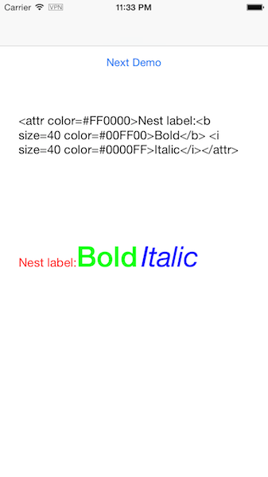

RTALabel 
=======

RTALabel is a rich text parser for UILabel to use html-like markups by using the Foundation's `NSAttributedString`.

Usage
-----

copy all the files in `Lib` dir into your xcode project,

then set a UILabel's attribute string with html-like text like this:

```
#import "UILabel+RichText.h"
...
@property (weak, nonatomic) IBOutlet UILabel *renderLabel;
...

NSString *str = "<attr color=#FF0000>Nest label:<b size=40 color=#00FF00>Bold</b> <i size=40 color=#0000FF>Italic</i></attr>",
[self.renderLabel setRichAttributedText:str];
```
here is the result:

 

support labels and attributes
-----

now,RTALabel support labels below:

* b => bold font
* i => italic font
* attr => a flag for RTALabel to parse it's attributes
* u => underline
* del => delete line or Strikethrough line
* p => Paragraph style label
* image => insert image into label.
* space => space between characters.

and attributes:

* color (support css style color:`#FF0000`, and an alpha style:`#FF000033` which means red in 0.2( 33/FF or 51.0/255.0) alpha.
* bg_color the background color of a text
* size the font size of a text
* lineColor(only `u` and `del` label support this attribute)
* lineSpace(only `p` label support this attribute)
* indent(only `p` label support this attribute)
* paragraphSpacing(only `p` label support this attribute)
* fontName ( `b` and `i` not support it,because these two labels only show the system font name. You can use `fontName` to satisfy a bold or italic font, e.g. `fontName=Verdana-Italic`)
* fontStyle (`b` and `i` not support it . It cannot work together whith `fontName` because you can satisfy it by use the font name directry. so it only support system font.) `medium`,`bold`,`light`,`thin`,`heavy`,`semiBold`,`black`,`ultraLight`
* imageName(only `image` label support this attribute)
* bounds(only `image` label support this attribute)
* value(only `space` label support this attribute)
